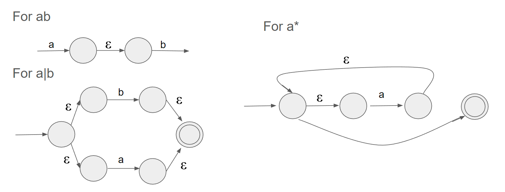

#### LL1

Left recursion: A -> Ax|y 
change to: A->yA', A'->xA'|epsilon

Left factoring: A -> xm| xn | ....
change to: A -> xA', A' -> m|n|...
##### First-follow set
First:
- terminal's first is self
- if X->epsilon is a production, then epsilon is in first(X)
- for X -> Y1, Y2.....
	- if Y is a non-terminal and first(Y) contains epsilon, add first(Y) without epsilon to first(X), keep going
	- if Y is a terminal, add Y
	- if add end, if the end Y's first has epsilon, add epsilon to first(X)
Follow:
- Add $ to start's(S) follow
- for A -> axb:
	- add first(b) to follow(x)
	- if first(b) contains epsilon:
		- add follow(b) to follow(x)
		- if propulsion, add follow(A) to follow(x)
	- if b is the end, add follow(A) to follow(b)

###### Conflicts

First-first: First sets of 2 non-terminals intersect
First-follow: First set of a non-terminal contains epsilon, and the intersection with its follow set is non-empty.

##### Generating LL1
For each non terminal X's production X->ABCD...
1. For each terminal t in first(A), M[X,t] = A
2. If epsilon is in first(A), for each terminal t in follow(X), M[X,t] = epsilon

###### Conflicts
Parse table can have at most one production rule per cell, otherwise, there is conflicts

##### LR(1)
Shift-reduce: shift the . on next token t, or reduce on t when the . is on the right end of a production
Reduce-reduce: when the . is on the right end of 2 productions that can be both reduced on t.

#### Garbage Collection
Mark and Sweep:   
- todo-list/free list can be too large. Solution: storing them in objects directly as auxiliary data.
- adv: no need to update ptrs
- dis: fragmentation

Stop and Copy:
Start|Scan|Alloc ptrs to memory
1. For 1st marked obj, copy them to new region, set forwarding ptrs.
2. Start Scanning:
	- for each unscanned obj:
	- for each ptr in obj, copy pointed obj, set their forwarding pointers.
	- and scan them as well.

#### Register Inference
##### RIG
not n-colorable if is (n+1) clique

##### Spilling
after spilling:
before use: f := load fa (only after this f is live)
after define: store f, fa (only before this f is live)